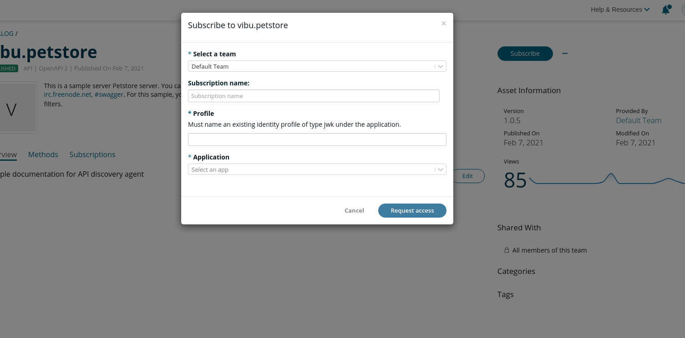
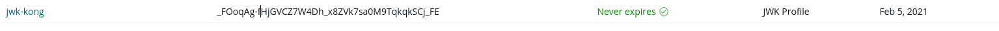

# ApiKey

## Prerequisites

### Kong

A service exposed by a route with either a route, service or global [JWT
Plugin](https://docs.konghq.com/hub/kong-inc/jwt/) configured.

1.  Sample config

    ``` restclient
    POST http://localhost:8001/services
    Content-Type: application/json

    {
    "name": "petstore",
    "url": "http://petstore.swagger.io",
    "tags": ["spec_local_petstore.json"]
    }
    ```

    ``` restclient
    POST http://localhost:8001/services/petstore/routes
    Content-Type: application/json

    {
    "name": "petstore",
    "paths": ["/petstore"],
    "hosts": ["localhost"]
    }
    ```

    ``` restclient
    POST http://localhost:8001/routes/petstore/plugins
    Content-Type: application/json

    {
    "name": "key-auth"
    }
    ```

### APICentral

Once the API is discovered a catalog item should be populated and
available for subscription.

## Add subscription

From the catalog item click subscribe. Either type in your on api key or
leave empty for autogeneration. Click subscrive.

As a provider you can click approve. Once Approval is given wait \~30s
and refresh page. If all went well subscription should be active.

If you chose to have the key generated as a choice then the apikey field
should now contain all.

### Testing

``` bash
curl https://<<kong-proxy-url>>/petstore/store/inventory?apikey=<<your_api_key>>
```

# JWT

Only RS256 assimetric JWT supported.

Only works with default kong jwt settings. Kong expects an unique key in
the iss claim, the agent configures that to be the JWK Kid from the
APICentral identity profile. See below.

## Prerequisites

### Kong

A service exposed by a route with either a route, service or global [JWT
Plugin](https://docs.konghq.com/hub/kong-inc/jwt/) configured.

1.  Sample config

    ``` restclient
    POST http://localhost:8001/services
    Content-Type: application/json

    {
    "name": "petstore",
    "url": "http://petstore.swagger.io",
    "tags": ["spec_local_petstore.json"]
    }
    ```

    ``` restclient
    POST http://localhost:8001/services/petstore/routes
    Content-Type: application/json

    {
    "name": "petstore",
    "paths": ["/petstore"],
    "hosts": ["localhost"]
    }
    ```

    ``` restclient
    POST http://localhost:8001/routes/petstore/plugins
    Content-Type: application/json

    {
    "name": "jwt"
    }
    ```

### APICentral

Once the API is discovered a catalog item should be populated and
available for subscription.

The subscription requires an application with a configured JWK identity
profile.

1.  Sample config

    [Create an
    application.](https://apicentral.axway.com/applications/add)

    Use openssl to create a public

    ``` bash
    openssl genrsa -out /tmp/sigjwt_private_no_passphrase.pem 2048

    openssl rsa -pubout -in /tmp/sigjwt_private_no_passphrase.pem -outform PEM -out /tmp/public.pem
    ```

    On the `Identity Profiles` tab of the newly created application, add
    a JWK profile. Remember the name of the JWK profile.

    Add the public key by uploading `/tmp/public.pem`.

## Add subscription

From the catalog item click subscribe. Select the app from the dropdown
and type the name of your JWK profile. Click request access.



As a provider you can click approve. Once Approval is given wait \~30s
and refresh page. If all went well subscription should be active.

### Testing

Use script below to generate a jwt token using the private key generated
above:

-   replace &lt;&lt;appid&gt; with the application id or name
-   replace <span id="jwtkeyid"></span>with the JWK ID in central jwk
    profile. To fetch that, go to the application, look for jwk
    profiles, the JWK ID will be the second listing



``` bash
set -o pipefail

header_template='{
    "typ": "JWT"
}'

build_header() {
        jq -c \
                --arg alg "${1}" \
                --arg keyid "${2}" \
        '
        .alg = $alg | .kid = $keyid
        ' <<<"$header_template" | tr -d '\n'
}

build_body() {
    jq -c \
                --arg appid "${1}" \
                --arg iat_str "$(date +%s)" \
        '
        ($iat_str | tonumber) as $iat
        | .sub = $appid
        | .aud = $appid
        | .iss = $jwtkeyid
        ' <<<"{}" | tr -d '\n'
}

b64enc() { openssl enc -base64 -A | tr '+/' '-_' | tr -d '='; }
json() { jq -c . | tr -d '\n'; }
rs_sign() { openssl dgst -binary -sha256 -sign "$1"; }

sign() {
        local payload header sig signed_content secret=$1 appid=$2 jwtkeyid=$3
        header=$(build_header "RS256" "$jwtkeyid")
        payload=$(build_body $appid)
        signed_content="$(json <<<"$header" | b64enc).$(json <<<"$payload" | b64enc)"
        sig=$(printf %s "$signed_content" | rs_sign "$secret" | b64enc)
        printf '%s.%s\n' "${signed_content}" "${sig}"
}

sign /tmp/sigjwt_private_no_passphrase.pem <<appid>> <<jwtkeyid>>
```

With the token generated above call the exposed kong api:

``` bash
curl -H "Authorization: Bearer <<TOKEN>>" https://<<kong-proxy-url>>/petstore/store/inventory
```

# TODOS

## Refactor acl configuration to subscription manager

## Subscription manager should fetch effective plugins and rerun IsApplicable

## Subscription manager should create/update the consumer and pass it to specific subscription handlers
